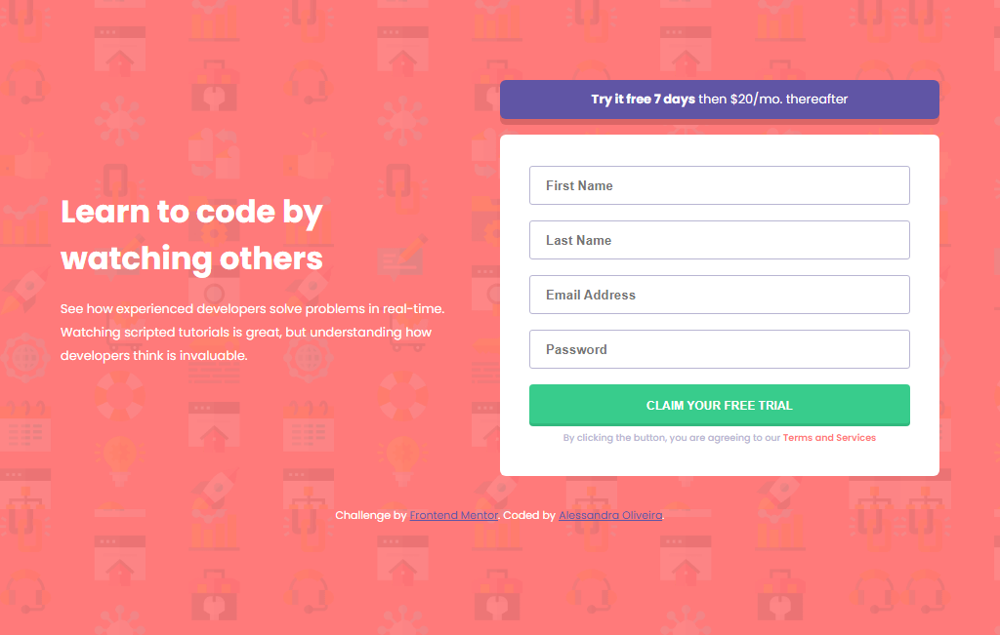
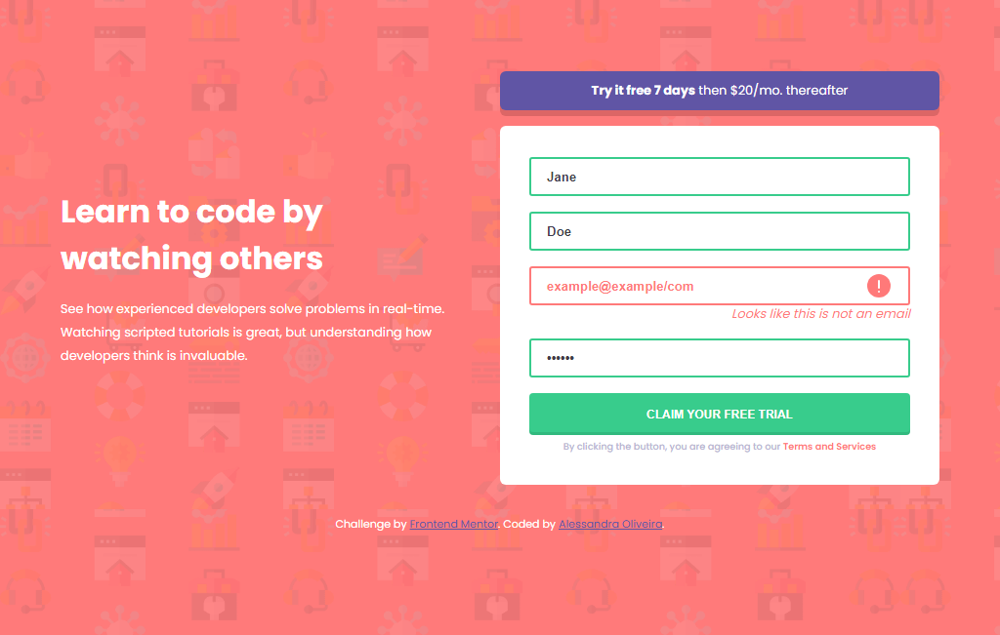
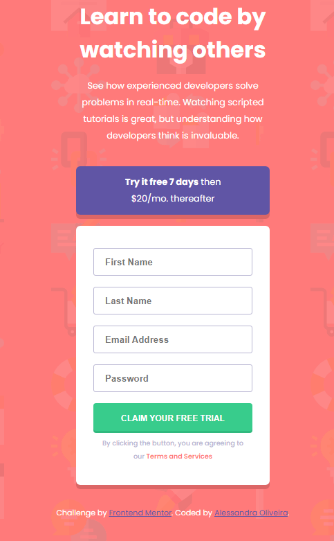
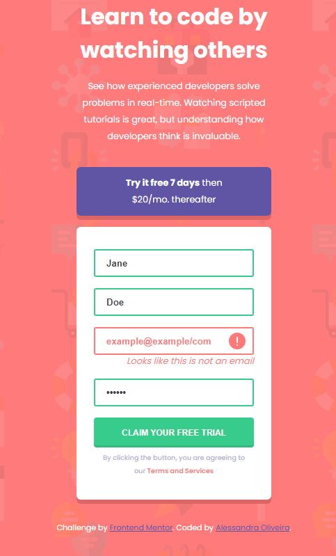

# Frontend Mentor - Intro component with sign up form solution

This is a solution to the [Intro component with sign up form challenge on Frontend Mentor](https://www.frontendmentor.io/challenges/intro-component-with-signup-form-5cf91bd49edda32581d28fd1).

## Table of contents

- [Overview](#overview)
  - [The challenge](#the-challenge)
  - [Screenshot](#screenshot)
  - [Links](#links)
- [My process](#my-process)
  - [Built with](#built-with)
- [Author](#author)

## Overview

This is my solution to the intro component with signup form challenge on frontend mentor. It was built enterily with HTML, CSS ans JavaScript.

### The challenge

Users should be able to:

- View the optimal layout for the site depending on their device's screen size
- See hover states for all interactive elements on the page
- Receive an error message when the `form` is submitted if:
  - Any `input` field is empty. The message for this error should say *"[Field Name] cannot be empty"*
  - The email address is not formatted correctly (i.e. a correct email address should have this structure: `name@host.tld`). The message for this error should say *"Looks like this is not an email"*

### Screenshot

**Desktop Solution:** this is what the solution looks like on desktop devices

  

**Desktop Solution (active):** this is the active state of the desktop solution 

  

**Mobile Solution:** this is what the solution looks like on mobile devices

  

**Mobile Solution (active):** this is the active state of the mobile solution 

  

### Links

- Solution URL: [Frontend Solution](https://your-solution-url.com)
- Live Site URL: [Github Pages](https://your-live-site-url.com)

## My process

### Built with

- Semantic HTML5 markup
- CSS custom properties
- Flexbox
- CSS Grid
- JavaScript
- 
## Author

- LinkedIn - [Alessandra Oliveira](https://www.linkedin.com/in/alessandra-santos-oliveira/)
- Frontend Mentor - [@itsale-o](https://www.frontendmentor.io/profile/itsale-o)
- Twitter - [@itsale_o](https://www.twitter.com/itsale_o)
